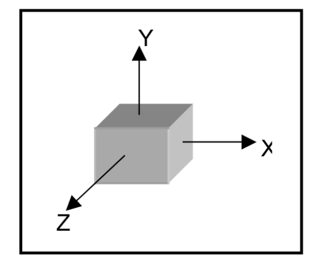
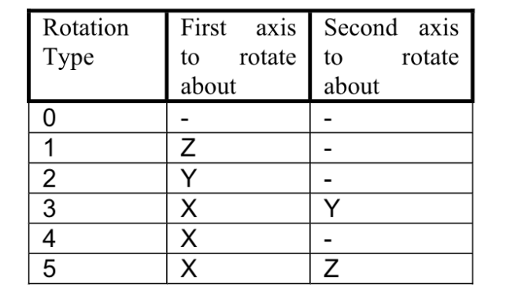

## Pivot and Rotation
We refer to a rotationType because of the paper ascribed to this.
We are actually pivoting items in the bin.

### Pivot
Imagine a cube on a table. If you were to turn the cube onto another side without shifting the cube, you are pivoting the cube.
The end position of that cube would not be the same as where it started, only 1 edge would be touching where another edge was touching.

### Rotate
Imagine holding a cube above a table that is casting a shadow directly down. If you were to rotate that box to another side the shadow would be in the same place as it was before you started.

Below is the chart of Rotation Types. Remember that we are pivoting each axis in order and by 90 degress

